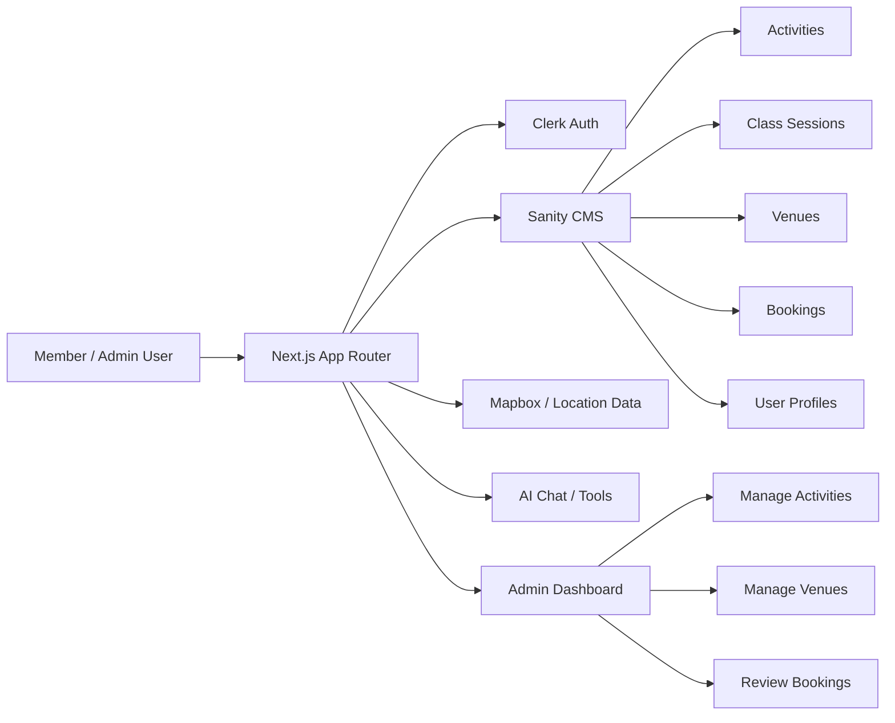

# FitPass

FitPass is a fitness membership and class-booking platform built with Next.js, Sanity, and Clerk. It supports a customer-facing experience for browsing classes and booking sessions, plus an admin experience for managing activities, venues, and bookings.

## Tech stack

- Next.js 16 App Router
- React 19
- TypeScript
- Tailwind CSS
- Sanity CMS
- Clerk authentication
- Base UI components
- Lucide icons

## Features

- Member landing page with plans and class discovery
- Session and booking flows for fitness classes
- Venue and activity management in the admin UI
- Sanity-powered content and data modeling
- Interactive maps and location-aware venue selection
- AI chat support for user interactions

## Getting started

1. Install dependencies

```bash
npm install
```

2. Set up your environment variables.

Create a `.env.local` file in the project root with the required values for Sanity and Clerk, for example:

```bash
NEXT_PUBLIC_SANITY_PROJECT_ID=your_project_id
NEXT_PUBLIC_SANITY_DATASET=production
NEXT_PUBLIC_SANITY_API_VERSION=2026-08-09
NEXT_PUBLIC_MAPBOX_ACCESS_TOKEN=your_mapbox_token
SANITY_API_TOKEN=your_sanity_write_token
NEXT_PUBLIC_CLERK_PUBLISHABLE_KEY=your_clerk_publishable_key
CLERK_SECRET_KEY=your_clerk_secret_key
```

3. Start the app in development mode

```bash
npm run dev
```

Then open http://localhost:3000 in your browser.

## Useful scripts

```bash
npm run dev
npm run build
npm run start
npm run lint
npm run typegen
```

- `npm run dev` starts the Next.js app
- `npm run build` creates a production build
- `npm run start` runs the production build locally
- `npm run lint` runs the Biome checks
- `npm run typegen` extracts and generates Sanity types

## Project structure

- `app/` — app routes and pages
- `components/` — UI and feature components
- `lib/` — shared logic, helpers, actions, and constants
- `sanity/` — Sanity configuration, client setup, and schema utilities
- `public/` — static assets

## Short architecture diagram



## Sanity and content model

This project uses Sanity for structured content such as:

- activities
- class sessions
- venues
- bookings
- user profiles

The schema definitions live under the Sanity schema folder and are used by the admin tools and frontend queries.

## Admin flows

The app includes an admin experience for:

- creating and managing activities
- scheduling sessions
- managing venues
- reviewing bookings and attendance

## Notes

This project is configured as a custom FitPass application rather than a default starter template, so local setup and production behavior depend on the environment variables above and the Sanity/Clerk services connected to your project.
